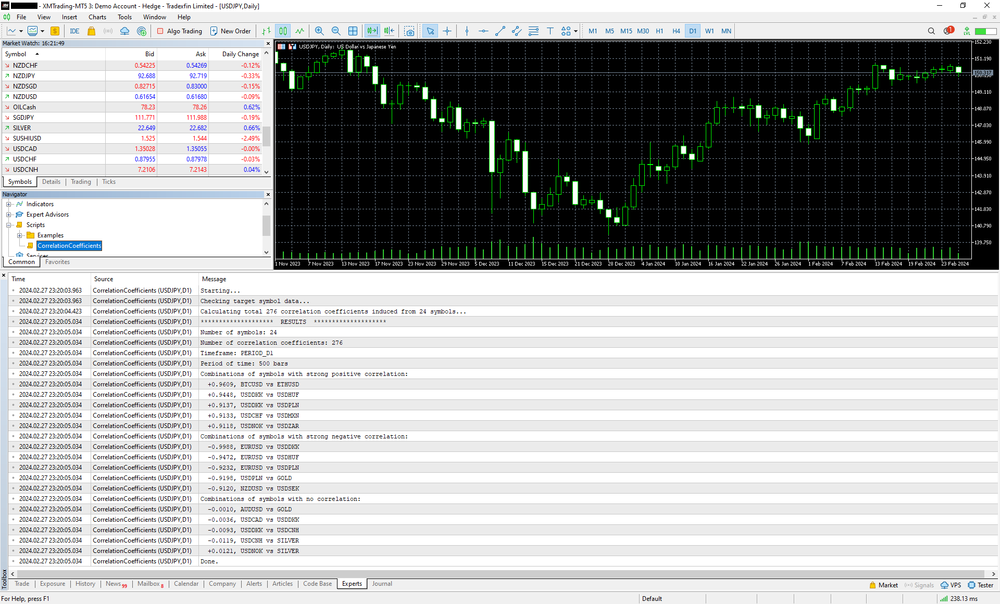

# CorrelationCoefficients
## 概要
MT5の各シンボルの相関係数を表示するスクリプトです。強い正の相関・強い負の相関・相関なしの3つに分けて表示します。
- 強い正の相関 … 相関係数が+0.7以上、かつ、値の大きい順に5つを表示します。
- 強い負の相関 … 相関係数が-0.7以下、かつ、値の小さい順に5つを表示します。
- 相関なし … 相関係数が±0.15の範囲内、かつ、絶対値の小さい順に5つを表示します。

## 計算方法
相関係数は以下の定義に従って計算しています。 
https://ja.wikipedia.org/wiki/相関係数

## 使用方法
1. ReleasesからCorrelationCoefficients.zipをダウンロードします。
1. zipファイルの内容をMT5のデータフォルダにコピーします。  
    ※ デフォルトのデータフォルダは以下：
    C:\Users\（ユーザー名）\AppData\Roaming\MetaQuotes\Terminal\（インスタンスID）
1. MT5を起動します。
1. サーバーにログインします。 
1. NavigatorウィンドウのScriptsツリーからCorrelationCoefficientsをチャートに貼り付けます。  

## パラメータ
指定可能なパラメータは以下の通りです。
<table>
  <tr>
    <th>パラメータ名</th>
    <th>詳細</th>
  </tr>
  <tr>
    <td>IgnoreCrossCurrencies</td>
    <td>計算対象のシンボルからクロス通貨（取引通貨または決済通貨のいずれにもUSDが含まれない通貨）を除外します。このパラメータはシンボルのセクターがCurrencyまたはCrypto Currencyの場合のみ考慮されます。</td>
  </tr>
  <tr>
    <td>MaximumNumberOfItems</td>
    <td>表示する項目の最大数を指定します。デフォルトは5です。</td>
  </tr>
  <tr>
    <td>TimeFrame</td>
    <td>計算対象となる時間足を指定します。デフォルトはcurrent（現在のチャートの時間足）です。</td>
  </tr>
  <tr>
    <td>PeriodOfTime</td>
    <td>計算対象となるローソク足の数を指定します。デフォルトは500です。</td>
  </tr>
</table>

## 必要なもの
- 本ツールの利用にはMT5が必要です。本ツールはどの証券会社のMT5でも動作します。

## 補足
- 気配値表示ウィンドウに表示されているシンボルが計算対象になるため、多くのシンボルを表示していると動作が遅くなります。気になる場合はいくつかを非表示にしてください。
- シンボルの種類によって取引可能日が異なるため、チャートデータの期間に差異があります（例えば株は祝日を除く平日、通貨は平日すべて、暗号資産は年間すべてのチャートデータになる）。比較対象シンボルに差異がある場合は、共通している期間のみの相関係数が計算されます。
- MT4では動作しません。コンパイルも通りません。
